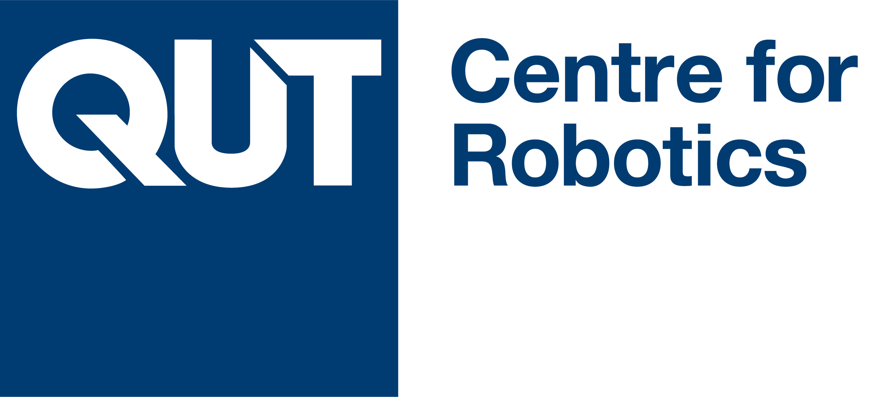

## Closing the Loop on Localization

Localization, mapping, visual place recognition and Simultaneous Localization And Mapping (SLAM) techniques are never the end, but rather a means to enable higher level tasks for robots and people alike. Major advances in localization capability have been made in the robotics, computer vision and machine learning fields, especially over the past two decades with the advent of mature SLAM systems and modern machine-learning driven approaches. Yet localization technology is still sparsely deployed in enduring large scale commercial applications, and despite the adage that “SLAM is solved”, for many applied roboticists it is abundantly clear that there are substantial challenges to still overcome.  

Involving both researchers and end-users from industry, this workshop will focus on the key reasons we are developing localization and mapping systems, and use those insights to drive a reflection on the key methods by which we are approaching localization research. We’ll evaluate whether there are new innovations required in techniques, how we can improve the metrics and benchmarks by which we assess performance in the research field to make them better proxies of performance in actual deployed situations. To maximize inclusivity we are providing substantial funding support to support researchers from under-represented and lower socio-economic regions to attend and participate in the workshop.

### Provocative Questions We Hope to Make Progress on as a Community

- what are the specific use cases for full SLAM approaches, when is semi-supervised or collaborative SLAM 'enough', and when do we only need localization and/or visual place recognition?
- are the current performance metrics we use like recall at X sufficient for enabling real-world utility? What better performance metrics could we design and support as a community?
- how do we currently benchmark localization systems, and is our reliance in the research community on passive dataset-based testing hurting us in the long run? What could we do better, including the use of simulation and real-robot benchmark testing platforms?
- are our research goals as a field too focused on beating the previous state-of-the-art by a few percent? What other goals could we better pursue, like generality?
- viewpoint- and appearance-invariance have emerged as two of the key themes shaping much vision-based localization research... is this the right categorization?
- localization is a vibrant field across robotics, computer vision and machine learning fields - is this a good thing, bad thing, or somewhere in the middle?

### Scope of Potential Research Contributions

- Novel or updated evaluation metrics
- Encoding equivariance or invariance in place representations
- Semantics based localization
- Natural language, localization and navigation
- Large language models for place recognition and localization
- Neural implicit representations and models for mapping and localization
- Long-term autonomy
- Sequences/videos for place recognition and localization
- VPR for SfM versus VPR for SLAM
- Impact of VPR on the performance of SfM and SLAM
- From place recognition and 6-DoF localization to robot navigation
- SLAM vs Localization-only (given the map)
- New benchmarks and datasets

## Schedule

Tentative:

| Time &nbsp; &nbsp; &nbsp;    | Event                                  |
|----------|----------------------------------------|
| 08:45 am | Welcome                                |
| 09:00 am | Keynote I - Industry and End User Talks                   |
| 09:30 am | Keynote II - Industry                  |
| 10:00 am | 6 x Spotlight Talks (Industry / End Users) |
| 10:30 am | Morning Tea and Poster Sessions        |
| 11:00 am | Technical Session: Codebases, Benchmarks, Robot Evaluation and Performance Metrics      |
| 12:00 pm | Lunch & Posters                        |
| 01:30 pm | Keynote III - Researchers / Academia       |
| 02:00 pm | Keynote IV - Researchers / Academia       |
| 02:30 pm | Spotlight Talks (Research / Academia)     |
| 03:30 pm | Afternoon Tea and Poster Sessions  |
| 04:00 pm | Panel Debate                        |
| 04:50 pm | Workshop Wrapup and Summary           |

## Important Dates

Tentative:

| Event                              | Date        |
|--------------------------------|-------------|
| Paper Submission Due           | 31 Mar 2023 |
| Reviews Out                    | 18 Apr 2023 |
| Camera-Ready Paper+Posters Due | 25 Apr 2023 |
| Videos (Remote Presenters) Due | 30 Apr 2023 |
| Workshop Day                   | 29 May 2023 |

## Prizes and Awards

The workshop will provide substantial prizes in the following categories:

- Best Paper Award: the overall best submitted paper at the workshop
- Best Student Paper: the best student-led paper submitted to the workshop

## Workshop Outcomes

Workshop organizers are talking to journal editors to investigate the possibility of an opinion piece or survey paper resulting from the workshop.

## Support for Under-Represented Researchers

     

The workshop will provide a range of support mechanisms specifically to researchers from under-represented geographic regions and demographics. We are looking into the possibility of:

- funding ICRA2023 workshop registration fees to enable attendance at this workshop
- travel grants providing partial or full support for travel to attend the physical conference
- hardware support including GPUs
- software license support to help with conducting research in this area

## Submission Instructions

## FAQs

1. Can I attend remotely?  
  Yes, we will provide zoom details close to the day of workshop.  
2. For the prizes, do we need to attend in person to be eligible?  
  All presenters (remote or in-person) would be eligible for awards and prizes. 

## Organizers

<table style="text-align:center; border-collapse: collapse; border: hidden;">
  <tr style="border: hidden">
    <td></td>
    <td></td>
    <td></td>
    <td></td>
  </tr>
  <tr  style="border: hidden">
    <td valign="top">Sourav Garg</td>
    <td valign="top">Stephen Hausler</td>
    <td valign="top">Tobias Fischer</td>
    <td valign="top">Michael Milford</td>
  </tr>
  <tr style="font-size: small, border:hidden">
    <td valign="top">Research Fellow, QUT</td>
    <td valign="top">Research Fellow, QUT</td>
    <td valign="top">Lecturer, QUT</td>
    <td valign="top">Professor, QUT</td>
  </tr>
 </table>

## Organizations and Companies

     

