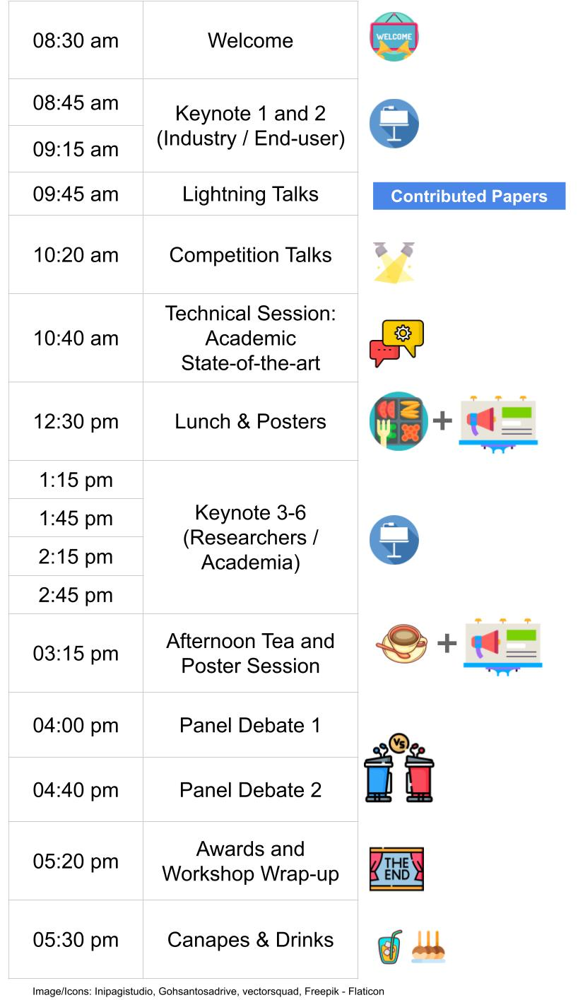
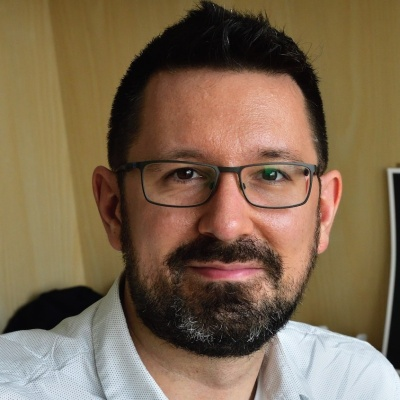
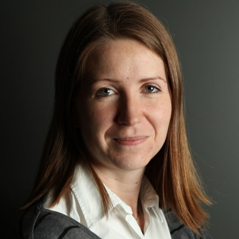

## Closing the Loop on Localization

Localization, mapping, visual place recognition and Simultaneous Localization And Mapping (SLAM) techniques are never the end, but rather a means to enable higher level tasks for robots and people alike. Major advances in localization capability have been made in the robotics, computer vision and machine learning fields, especially over the past two decades with the advent of mature SLAM systems and modern machine-learning driven approaches. Yet localization technology is still sparsely deployed in enduring large scale commercial applications, and despite the adage that “SLAM is solved”, for many applied roboticists it is abundantly clear that there are substantial challenges to still overcome.  

Involving both researchers and end-users from industry, this workshop will focus on the key reasons we are developing localization and mapping systems, and use those insights to drive a reflection on the key methods by which we are approaching localization research. We will evaluate whether there are new innovations required in techniques, how we can improve the metrics and benchmarks by which we assess performance in the research field to make them better proxies of performance in actual deployed situations. To maximize inclusivity we are providing substantial funding support to support researchers from under-represented and lower socio-economic regions to attend and participate in the workshop.

### Provocative Questions We Hope to Make Progress on as a Community

- What are the specific use cases for full SLAM approaches, when is semi-supervised or collaborative SLAM 'enough', and when do we only need localization and/or visual place recognition?
- Are the current performance metrics we use like Recall@X sufficient for enabling real-world utility? What better performance metrics could we design and support as a community?
- How do we currently benchmark localization systems, and is our reliance in the research community on passive dataset-based testing hurting us in the long run? What could we do better, including the use of simulation and real-robot benchmark testing platforms?
- Are our research goals as a field too focused on beating the previous state-of-the-art by a few percent? What other goals could we better pursue, like generality?
- Viewpoint- and appearance-invariance have emerged as two of the key themes shaping much vision-based localization research... is this the right categorization?
- Localization is a vibrant field across robotics, computer vision and machine learning fields - is this a good thing, bad thing, or somewhere in the middle?

### Call for Submissions

We invite you to submit high-quality extended abstracts, aligned with the theme of our workshop. Also, see [competition](#competition) and [financial support](#support-for-under-represented-researchers).

#### Scope of Potential Research Contributions

- Novel or updated evaluation metrics
- Encoding equivariance or invariance in place representations
- Semantics based localization
- Natural language, localization and navigation
- Large language models for place recognition and localization
- Foundation models for localization
- Neural implicit representations and models for mapping and localization
- Long-term autonomy
- Sequences/videos for place recognition and localization
- VPR for SfM versus VPR for SLAM
- Impact of VPR on the performance of SfM and SLAM
- From place recognition and 6-DoF localization to robot navigation
- SLAM vs Localization-only (given the map)
- New benchmarks and datasets

#### Format

We invite submissions in an extended abstract format: no longer than two pages excluding references (i.e., 2 + n). Please use IROS's suggested Latex [format](http://ras.papercept.net/conferences/support/tex.php) and upload a PDF (see below). The review process will be single blind, that is, the authors' names are not required to be anonymized, aligned with IROS paper submissions.

#### Submission Process
Please upload your paper through [OpenReview](https://openreview.net/group?id=IEEE.org/2023/IROS/Workshop/Localization). In the abstract field, you only need to mention whether you are submitting new work or it is an abridged version of a parallel/accepted submission. Accepted papers will be presented as posters and a selected few will also have an opportunity for lightning talks. These papers will be publicly accessible through the workshop webpage in a non-archival format, thus allowing future submission to archival venues. At least one author must be registered to attend IROS 2023 workshops [registration](https://ieee-iros.org/registration-travel/).

#### Important Dates

Tentative:

| Event                              | Date        |
|--------------------------------|-------------|
| Paper Submission Open           | 28 Jun 2023 |
| Paper Submission Due           | 24 Aug 2023 |
| Reviews Out                    | 20 Sep 2023 |
| Camera-Ready Due               | 26 Sep 2023 |
| Workshop Day                   | 01 Oct 2023 |

## Competition
From decades, place recognition has been applied to a range of localization and navigation tasks, but only a few methods have been proposed for large scale map assembling. On the other hand, with the development of autonomous driving, last mile delivery and multi agent cooperation, there is a huge demand for efficient and accurate large scale, crowd-sourced map updating. In this competition, General Place Recognition (GPR) for Autonomous Map Assembling, we provide a comprehensive evaluation platform of large scale LiDAR/IMU datasets,  repeatedly collected at different times in a variety of environments (city/park/indoor), with varying overlaps. The target is to assemble the joint large scale map based mainly on the place recognition ability without any GPS assistance.

We invite you to participate in the [competition](https://metaslam.github.io/competitions/icra2023/) led by Peng Yin and Sebastian Scherer from CMU. The winners will have the opportunity to present their work at this workshop. The challenge timeline is as below:

| Event                              | Date        |
|--------------------------------|-------------|
| Release Initial Dataset & Eval Tools           | 01 Aug 2023 |
| Release Final Competition Set           | 19 Sep 2023 |
| Submission Close                    | 24 Sep 2023 |
| Winners Notified                   | 25 Sep 2023 |
| Winners Presentations                   | 01 Oct 2023 |

## Prizes and Awards

The workshop will provide substantial prizes in the following categories:

- Best Overall Presentation Award, sponsored by Nvidia:
    - 1 Jetson Orin + RTX 4090 GPU and
    - Jetson Nano to each co-author to a max of 5 authors.
- Runner-up Paper Presentation Award, given to the student presenters at the spotlight sessions.
- Runner-up Poster Presentation Award, given to the student presenters at the poster sessions.
- Most engaging speaker amongst our invited speakers.
- Most active participant, actively engaging throughout the workshop event.

## Support for Under-Represented Researchers

We aim to provide opportunities for all researchers to be able to attend and foster further research in this area. We are proposing this scholarship program for researchers from under-represented geographic regions and demographics, totaling USD 3,500, which they can use for:

- funding IROS 2023 workshop registration fees to enable attendance at this workshop
- travel grants providing partial or full support for travel to attend the physical conference
- hardware support including GPUs
- software license support to help with conducting research in this area

Please use this [form](https://forms.office.com/r/gY4wx3G63U) to apply for this support. Due to limited capacity, we cannot guarantee supporting everyone, but we encourage you to apply as it will only take a few minutes.

     

## Schedule

Tentative:

     

## Workshop Outcomes

Workshop organizers are talking to journal editors to investigate the possibility of an opinion piece or survey paper resulting from the workshop.

## Invited Speakers

### Academia

    

        
        <h2><a href="https://www.doc.ic.ac.uk/~ajd/">Andrew Davison</a></h2>
        
Professor Imperial College London

    

    

        
        <h2>[Grace Gao](https://profiles.stanford.edu/gracegao)</h2>
        
Assis. Prof. Stanford

    

    

        
        <h2>[Ayoung Kim](https://ayoungk.github.io/)</h2>
        
Assoc. Prof. Seoul National Uni.

    

    

        
        <h2>[Ming Liu](https://facultyprofiles.hkust.edu.hk/profiles.php?profile=ming-liu-eelium)</h2>
        
Assoc. Prof. HKUST, Hong Kong

    

    

        
        <h2>[Peer Neubert](https://www.tu-chemnitz.de/etit/proaut/en/team/peerNeubert.html)</h2>
        
Professor Uni. Koblenz

    

    

        
        <h2>[Jean Oh](https://www.cs.cmu.edu/~./jeanoh/)</h2>
        
Assoc. R.Prof. CMU

    

    

        
        <h2>[Torsten Sattler](https://tsattler.github.io/)</h2>
        
Sr. Researcher CTU

    

    

        
        <h2>[Davide Scaramuzza](https://rpg.ifi.uzh.ch/people_scaramuzza.html)</h2>
        
Professor Uni. Zurich

    

    

        
        <h2>[Yue Wang](https://ywang-zju.github.io/)</h2>
        
Assoc. Prof. Zhejiang University, China

    

    

        
        <h2>[Barbara Webb](https://www.edinburgh-robotics.org/academics/barbara-webb)</h2>
        
Professor Uni. Edinburgh

    

### Industry

    

        
        <h2>[Michael Mangan](https://uk.linkedin.com/in/michaelmanganuk)</h2>
        
Co-founder Opteran

    

    

        
        <h2>[Yulia Sandamirskaya](http://sandamirskaya.eu/)</h2>
        
Sr. Researcher Intel

    

    

        
        <h2>[Shubham Shrivastava](https://www.linkedin.com/in/shubshrivastava)</h2>
        
Team Lead 3D Perception, Ford

    

    

        
        <h2>[Olga Vysotska](https://www.microsoft.com/en-us/research/people/olgavysotska/)</h2>
        
Research Scientist Microsoft

    

## Organizers

    

        
        <h2>Luca Carlone</h2>
        
Assoc. Prof. MIT

    

    

        
        <h2>Margarita Chli</h2>
        
Assis. Prof. ETHZ

    

    

        
        <h2>Tobias Fischer</h2>
        
Lecturer QUT

    

    

        
        <h2>Grace Gao</h2>
        
Assis. Prof. Stanford

    

    

        
        <h2>Sourav Garg</h2>
        
Research Fellow Uni. Adelaide

    

    

        
        <h2>Stephen Hausler</h2>
        
Research Scientist CSIRO

    

    

        
        <h2>Stephanie Lowry</h2>
        
Assoc. Sr. Lecturer Orebro University

    

    

        
        <h2>Michael Milford</h2>
        
Professor QUT

    

    

        
        <h2>Amir Patel</h2>
        
Assoc. Prof. Uni. Cape Town

    

    

        
        <h2>Sebastian Scherer</h2>
        
Assoc. Prof. CMU

    

    

        
        <h2>Olga Vysotska</h2>
        
Research Scientist Microsoft

    

    

        
        <h2>Peng Yin</h2>
        
Research Fellow CMU

    

## Organizations and Companies

<table class='myTable'>
  <tr style="border: hidden">
    <td style="border: hidden"></td>
    <td style="border: hidden"></td>
    <td style="border: hidden"></td>
  </tr>
  <tr style="border: hidden">
    <td style="border: hidden"></td>
    <td style="border: hidden"></td>
    <td style="border: hidden"></td>
  </tr>
  <tr style="border: hidden">
    <td style="border: hidden"></td>
    <td style="border: hidden"></td>
    <td style="border: hidden"></td>
  </tr>
</table>
