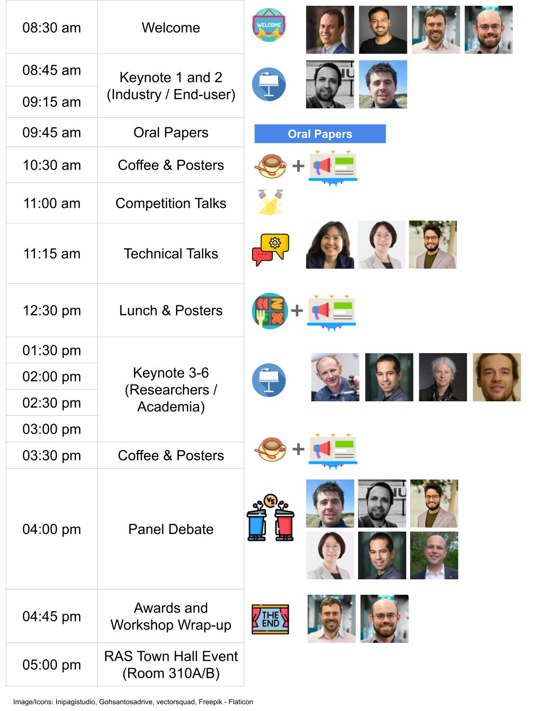

## Closing the Loop on Localization (IROS Room 330B)

Localization, mapping, visual place recognition and Simultaneous Localization And Mapping (SLAM) techniques are never the end, but rather a means to enable higher level tasks for robots and people alike. Major advances in localization capability have been made in the robotics, computer vision and machine learning fields, especially over the past two decades with the advent of mature SLAM systems and modern machine-learning driven approaches. Yet localization technology is still sparsely deployed in enduring large scale commercial applications, and despite the adage that “SLAM is solved”, for many applied roboticists it is abundantly clear that there are substantial challenges to still overcome.  

Involving both researchers and end-users from industry, this workshop will focus on the key reasons we are developing localization and mapping systems, and use those insights to drive a reflection on the key methods by which we are approaching localization research. We will evaluate whether there are new innovations required in techniques, how we can improve the metrics and benchmarks by which we assess performance in the research field to make them better proxies of performance in actual deployed situations. To maximize inclusivity we are providing substantial funding support to support researchers from under-represented and lower socio-economic regions to attend and participate in the workshop.

## Schedule (At a glance)

     

<!-- Link to the styles.css file -->
<link rel="stylesheet" type="text/css" href="styles.css">

## Detailed Schedule

<table class="conference-schedule">
    <tr>
        <th class="time-column">Time</th>
        <th class="type-column">Type</th>
        <th>Speaker</th>
        <th>Name/Affiliation</th>
        <th>Talk Title</th>
    </tr>
    <tr>
        <td class="time-column">08:30&nbsp;am</td>
        <td class="type-column">Welcome</td>
        <td></td>
        <!-- <td class="speaker-photo-cell">
            
            
            
            
        </td> -->
        <td class="name-affiliation-cell">
            

                
Michael, Sourav,  Tobias, Stephen

                <!-- 
(QUT/UofA/CSIRO)
 -->
            

        </td>
        <td></td>
    </tr>
    <tr>
        <td class="time-column">08:45&nbsp;am</td>
        <td class="type-column">Keynote 1 (Industry)</td>
        <td></td>
        <td class="name-affiliation-cell">
            

                
Punarjay Chakravarty

                
(Planet)

            

        </td>
        <td>Visual Localization and SLAM in the Automotive and Aerospace Industries</td>
    </tr>
    <tr>
        <td class="time-column">09:15&nbsp;am</td>
        <td class="type-column">Keynote 2 (Industry) </td>
        <td></td>
        <td class="name-affiliation-cell">
            

                
Michael Mangan

                
(Opteran)

            

        </td>
        <td>Opteran: Enabling machines to move like natural creatures</td>
    </tr>
    <tr>
        <td class="time-column">09:45&nbsp;am</td>
        <td class="type-column">Oral Papers</td>
        <td></td>
        <td></td>
        <td></td>
    </tr>
    <tr>
        <td class="time-column">10:30&nbsp;am</td>
        <td class="type-column">Coffee & Posters</td>
        <td></td>
        <td></td>
        <td></td>
    </tr>
    <tr>
        <td class="time-column">11:00&nbsp;am</td>
        <td class="type-column">GPR Competition</td>
        <td></td>
        <td class="name-affiliation-cell">
            

                
Peng Yin

                
(CityU/CMU)

            

        </td>
        <td></td>
    </tr>
    <tr>
        <td class="time-column">11:15&nbsp;am</td>
        <td class="type-column">Technical Talk 1</td>
        <td></td>
        <td class="name-affiliation-cell">
            

                
Jean Oh

                
(CMU)

            

        </td>
        <td>Social Attention: The Missing Piece in Robot Deployment</td>
    </tr>
    <tr>
        <td class="time-column">11:40&nbsp;am</td>
        <td class="type-column">Technical Talk 2</td>
        <td></td>
        <td class="name-affiliation-cell">
            

                
Ayoung Kim

                
(SNU)

            

        </td>
        <td>Defining and Learning Feature for Visual and LiDAR Localization</td>
    </tr>
    <tr>
        <td class="time-column">12:05&nbsp;pm</td>
        <td class="type-column">Technical Talk 3</td>
        <td></td>
        <td class="name-affiliation-cell">
            

                
Shubham Shrivastava

                
(Kodiak)

            

        </td>
        <td>It’s what you see, not where you are!: Localization through Perception Lens</td>
    </tr>
    <tr>
        <td class="time-column">12:30&nbsp;pm</td>
        <td class="type-column">Lunch & Posters</td>
        <td></td>
        <td></td>
        <td></td>
    </tr>
    <tr>
        <td class="time-column">01:30&nbsp;pm</td>
        <td class="type-column">Keynote 3 (Academia)</td>
        <td></td>
        <td class="name-affiliation-cell">
            

                
Andrew Davison

                
(Imperial College)

            

        </td>
        <td>TBD</td>
    </tr>
    <tr>
        <td class="time-column">02:00&nbsp;pm</td>
        <td class="type-column">Keynote 4 (Academia)</td>
        <td></td>
        <td class="name-affiliation-cell">
            

                
Davide Scaramuzza

                
(U. Zurich)

            

        </td>
        <td>Agile Drone Navigation: from Vision to No Vision at All!</td>
    </tr>
    <tr>
        <td class="time-column">02:30&nbsp;pm</td>
        <td class="type-column">Keynote 5 (Academia)</td>
        <td></td>
        <td class="name-affiliation-cell">
            

                
Barbara Webb

                
(U. Edinburgh)

            

        </td>
        <td>What can robotics learn from insect localization strategies?</td>
    </tr>
    <tr>
        <td class="time-column">03:00&nbsp;pm</td>
        <td class="type-column">Keynote 6 (Academia)</td>
        <td></td>
        <td class="name-affiliation-cell">
            

                
Peer Neubert

                
(U. Koblenz)

            

        </td>
        <td>What makes visual place recognition easy or hard?</td>
    </tr>
    <tr>
        <td class="time-column">03:30&nbsp;pm</td>
        <td class="type-column">Coffee & Posters</td>
        <td></td>
        <td></td>
        <td></td>
    </tr>
    <tr>
        <td class="time-column">04:00&nbsp;pm</td>
        <td class="type-column">Panel Debate</td>
        <td></td>
        <td class="name-affiliation-cell">
            

                
Michael Mangan, Punarjay Chakravarty, Shubham Shrivastava

                
Ayoung Kim, Davide Scaramuzza, Sebastian Scherer

            

        </td>
        <td></td>
    </tr>
    <tr>
        <td class="time-column">04:45&nbsp;pm</td>
        <td class="type-column">Awards and Workshop Wrap-up</td>
        <td></td>
        <td class="name-affiliation-cell">
            

                
Tobias Fischer

                
Stephen Hausler

            

        </td>
        <td></td>
    </tr>
    <tr>
        <td class="time-column">05:00&nbsp;pm</td>
        <td class="type-column">RAS Town Hall Event (Room 310A/B)</td>
        <td></td>
        <td></td>
        <td></td>
    </tr>
</table>

## Invited Speakers

### Academia

    

        
        <h2><a href="https://www.doc.ic.ac.uk/~ajd/">Andrew Davison</a></h2>
        
Professor Imperial College London

    

    

        
        <h2><a href="https://ayoungk.github.io/">Ayoung Kim</a></h2>
        
Assoc. Prof. Seoul National Uni.

    

    <!-- 

        
        <h2><a href="https://facultyprofiles.hkust.edu.hk/profiles.php?profile=ming-liu-eelium">Ming Liu</a></h2>
        
Assoc. Prof. HKUST, Hong Kong

    
 -->
    

        
        <h2><a href="https://www.tu-chemnitz.de/etit/proaut/en/team/peerNeubert.html">Peer Neubert</a></h2>
        
Professor Uni. Koblenz

    

    

        
        <h2><a href="https://www.cs.cmu.edu/~./jeanoh/">Jean Oh</a></h2>
        
Assoc. R.Prof. CMU

    

    

        
        <h2><a href="https://rpg.ifi.uzh.ch/people_scaramuzza.html">Davide Scaramuzza</a></h2>
        
Professor Uni. Zurich

    

    <!-- 

        
        <h2><a href="https://ywang-zju.github.io/">Yue Wang</a></h2>
        
Assoc. Prof. Zhejiang University, China

    
 -->
    

        
        <h2><a href="https://www.edinburgh-robotics.org/academics/barbara-webb">Barbara Webb</a></h2>
        
Professor Uni. Edinburgh

    

### Industry

    

        
        <h2><a href="https://uk.linkedin.com/in/michaelmanganuk">Michael Mangan</a></h2>
        
Research Director Opteran Technologies

    

    

        
        <h2><a href="https://www.linkedin.com/in/punarjay-chakravarty">Punarjay Chakravarty</a></h2>
        
SE ML Eng. Planet

    

    

        
        <h2><a href="https://www.linkedin.com/in/shubshrivastava">Shubham Shrivastava</a></h2>
        
Head ML, Kodiak Robotics

    

## Accepted Papers

### Oral

| Time | Paper Title                              | Authors (**Presenter boldfaced**)       |
|-------|------------------------------------------------------------|---------------------------------|
| 09:45 |[ConPR: Ongoing Construction Site Dataset for Place Recognition](./assets/accepted_papers/1_conpr_ongoing_construction_sit.pdf)           | **Dongjae Lee**, Minwoo Jung, Ayoung Kim |
| 09:52 | [Learned Inertial Odometry for Autonomous Drone Racing](./assets/accepted_papers/3_learned_inertial_odometry_for_.pdf)           | **Giovanni Cioffi**, Leonard Bauersfeld, Elia Kaufmann, Davide Scaramuzza |
| 10:00 | [Alignability maps for the prediction and mitigation of localization error](./assets/accepted_papers/7_alignability_maps_for_the_pred.pdf)                    | **Manuel Castellano-Quero**, Tomasz Piotr Kucner, Martin Magnusson |
| 10:07 | [Operational requirements for localization in autonomous vehicles](./assets/accepted_papers/8_operational_requirements_for_l.pdf)                   | **Arpan Kusari**, Satabdi Saha |
| 10:15 | [Sensor Localization by Few Distance Measurements via the Intersection of Implicit Manifolds](./assets/accepted_papers/10_sensor_localization_by_few_dis.pdf)                   | **Michael Moshe Bilevich**, Steven LaValle, Dan Halperin |
| 10:22 | [Look Both Ways: Bidirectional Sensing for Automatic Multi-Camera Registration](./assets/accepted_papers/12_look_both_ways_bidirectional_s.pdf)                   | **Subodh Mishra**, Sushruth Nagesh, Sagar Manglani, Shubham Shrivastava, Graham Mills, Punarjay Chakravarty, Gaurav Pandey |

### Posters

| Paper Title                              | Authors        |
|------------------------------------------------------------|---------------------------------|
|[Robust 3D-SLAM Algorithms in Malaysia’s Palm Oil Plantations: Assessing Effectiveness under Diverse Lighting Conditions](./assets/accepted_papers/2_robust_3d_slam_algorithms_in_m.pdf)           | Siti Sarah Md Sallah, Siti Sofiah Mohd Radzi, Lee Ming Yi, Syaimaa Solehah Mohd Radzi, Hon Hock Woon |
| [Long-range UAV Thermal Geo-localization with Satellite Imagery](./assets/accepted_papers/4_long_range_uav_thermal_geo_loc.pdf)           | Jiuhong Xiao, Daniel Tortei, Eloy Roura, Giuseppe Loianno |
| [The Invisible Map: Visual-Inertial SLAM with Fiducial Markers for Smartphone-based Indoor Navigation](./assets/accepted_papers/5_the_invisible_map_visual_inert.pdf)                    | Paul Ruvolo, Ayush Chakraborty, Rucha Dave, Richard Li, Duncan Mazza, Xierui Shen, Raiyan Siddique, Krishna Suresh |
| [Multi-Robot Autonomous Exploration and Mapping Under Localization Uncertainty with Expectation-Maximization](./assets/accepted_papers/6_multi_robot_autonomous_explora.pdf)                   | Yewei Huang, Brendan Englot |
| [SONIC(SONar Image Correspondence): Pose Supervised Learning for Forward Looking Sonar Image Matching](./assets/accepted_papers/9_sonic_sonar_image_corresponden.pdf)                   | Samiran Gode, Akshay Hinduja, Michael Kaess |
| [HARDNAV - Simulator for Benchmarking Robust Navigation and Place Recognition in Large, Confusing and Highly Dynamic Environments](./assets/accepted_papers/11_hardnav_simulator_for_benchmar.pdf)                   | Tomáš Musil, Martin Saska, Matěj Petrlík |
| [Learning Embeddings for Loop Closing Detection Using Graph Neural Network](./assets/accepted_papers/13_learning_embeddings_for_loop_c.pdf)                   | Abhishek Khoyani, Marzieh Amini |
| [Comparative Study of Visual SLAM-Based Mobile Robot Localization Using Fiducial Markers](./assets/accepted_papers/14_comparative_study_of_visual_sl.pdf)                   | Jongwon Lee, Su Yeon Choi, David Hanley, Timothy Bretl |

### Provocative Questions We Hope to Make Progress on as a Community

- What are the specific use cases for full SLAM approaches, when is semi-supervised or collaborative SLAM 'enough', and when do we only need localization and/or visual place recognition?
- Are the current performance metrics we use like Recall@X sufficient for enabling real-world utility? What better performance metrics could we design and support as a community?
- How do we currently benchmark localization systems, and is our reliance in the research community on passive dataset-based testing hurting us in the long run? What could we do better, including the use of simulation and real-robot benchmark testing platforms?
- Are our research goals as a field too focused on beating the previous state-of-the-art by a few percent? What other goals could we better pursue, like generality?
- Viewpoint- and appearance-invariance have emerged as two of the key themes shaping much vision-based localization research... is this the right categorization?
- Localization is a vibrant field across robotics, computer vision and machine learning fields - is this a good thing, bad thing, or somewhere in the middle?

### Call for Submissions

We invite you to submit high-quality extended abstracts, aligned with the theme of our workshop. Also, see [competition](#competition) and [financial support](#support-for-under-represented-researchers).

#### Scope of Potential Research Contributions

- Novel or updated evaluation metrics
- Encoding equivariance or invariance in place representations
- Semantics based localization
- Natural language, localization and navigation
- Large language models for place recognition and localization
- Foundation models for localization
- Neural implicit representations and models for mapping and localization
- Long-term autonomy
- Sequences/videos for place recognition and localization
- VPR for SfM versus VPR for SLAM
- Impact of VPR on the performance of SfM and SLAM
- From place recognition and 6-DoF localization to robot navigation
- SLAM vs Localization-only (given the map)
- New benchmarks and datasets

#### Format

We invite you to submit high-quality research either as a 2-page extended abstract or a 4-page short paper. Page counts exclude references (i.e., 2 + n and 4 + n). You are encouraged to use IROS's suggested Latex [format](http://ras.papercept.net/conferences/support/tex.php) and upload a PDF (see below). The review process will be single blind, that is, the authors' names are not required to be anonymized, aligned with IROS paper submissions. We encourae submissions of work-in-progress and work that is not yet published.

Accepted papers will be presented as posters, with a selected few in the spotlight lightning session.

#### Submission Process
Please upload your paper through [OpenReview](https://openreview.net/group?id=IEEE.org/2023/IROS/Workshop/Localization). For extended abstracts, you can write N/A in the abstract field when creating a submission on OpenReview. Please use the TLDR field in the submission to indicate whether you are submitting "new work" or it is an "abridged version of a parallel/accepted submission". These papers will be publicly accessible through the workshop webpage in a non-archival format, thus allowing future submission to archival venues. At least one author must be registered to attend IROS 2023 workshops to present their work (see [registration](https://ieee-iros.org/registration-travel/)).

#### Important Dates (Papers)

[Due 23:59 UTC-0]

| Event                              | Date        |
|--------------------------------|-------------|
| Paper Submission Open           | 28 Jun 2023 |
| Paper Submission Due           | 24 Aug 2023 |
| Reviews Out                    | 08 Sep 2023 |
| Camera-Ready Due               | 20 Sep 2023 |
| Workshop Day                   | 01 Oct 2023 |

## Competition
From decades, place recognition has been applied to a range of localization and navigation tasks, but only a few methods have been proposed for large scale map assembling. On the other hand, with the development of autonomous driving, last mile delivery and multi agent cooperation, there is a huge demand for efficient and accurate large scale, crowd-sourced map updating. In this competition, General Place Recognition (GPR) for Autonomous Map Assembling, we provide a comprehensive evaluation platform of large scale LiDAR/IMU datasets,  repeatedly collected at different times in a variety of environments (city/park/indoor), with varying overlaps. The target is to assemble the joint large scale map based mainly on the place recognition ability without any GPS assistance.

We invite you to participate in the [competition](https://metaslam.github.io/competitions/iros2023/) led by Peng Yin (CityU HK) and Sebastian Scherer (CMU). The winners will have the opportunity to present their work at this workshop. The challenge timeline is as below:

[Due 23:59 UTC-0]

| Event                              | Date        |
|--------------------------------|-------------|
| Release Initial Dataset & Eval Tools           | 01 Aug 2023 |
| Release Final Competition Set           | 15 Sep 2023 |
| Submission Close                    | 24 Sep 2023 |
| Winners Notified                   | 25 Sep 2023 |
| Winners Presentations                   | 01 Oct 2023 |

## Prizes and Awards

The workshop will provide substantial prizes in the following categories:

- Best Overall Presentation Award, sponsored by Nvidia:
    - 1 Jetson Orin + RTX 4090 GPU and
    - Jetson Nano to each co-author to a max of 5 authors.
- USD 500 - Runner-up Paper Presentation Award, given to the presenter at the lightning session.
- USD 500 - Runner-up Poster Presentation Award, given to the presenter at the poster sessions.
- USD 200 - Most engaging speaker amongst our invited speakers.
- USD 200 - Most active participant, actively engaging throughout the workshop event.

## Support for Under-Represented Researchers

We aim to provide opportunities for all researchers to be able to attend and foster further research in this area. We are proposing this scholarship program for researchers from under-represented geographic regions and demographics, totaling USD 3,500, which they can use for:

- funding IROS 2023 workshop registration fees to enable attendance at this workshop
- travel grants providing partial or full support for travel to attend the physical conference
- hardware support including GPUs
- software license support to help with conducting research in this area

Please use this [form](https://forms.office.com/r/gY4wx3G63U) to apply for this support by **20 Aug 2023 (23:59 UTC-0)** (You will be informed of the outcome by 24 Aug 2023). Due to limited capacity, we cannot guarantee supporting everyone, but we encourage you to apply as it will only take a few minutes.

     

## Organizers

    

        
        <h2><a href="https://lucacarlone.mit.edu/">Luca Carlone</a></h2>
        
Assoc. Prof. MIT

    

    

        
        <h2><a href="https://v4rl.com/blog/chli-margarita-dr1676387386/the-lab">Margarita Chli</a></h2>
        
Assis. Prof. ETHZ

    

    

        
        <h2><a href="https://www.tobiasfischer.info/">Tobias Fischer</a></h2>
        
Lecturer QUT

    

    

        
        <h2><a href="https://profiles.stanford.edu/gracegao">Grace Gao</a></h2>
        
Assis. Prof. Stanford

    

    

        
        <h2><a href="https://researchers.adelaide.edu.au/profile/sourav.garg">Sourav Garg</a></h2>
        
Research Fellow Uni. Adelaide

    

    

        
        <h2><a href="https://research.csiro.au/mlai-fsp/our-people/our-postdocs/">Stephen Hausler</a></h2>
        
Research Scientist CSIRO

    

    

        
        <h2><a href="https://jaykarhade.github.io/">Jay Karhade</a></h2>
        
M.S. Robotics CMU

    

    

        
        <h2><a href="https://www.oru.se/english/employee/stephanie_lowry">Stephanie Lowry</a></h2>
        
Assoc. Sr. Lecturer Orebro University

    

    

        
        <h2><a href="https://www.qut.edu.au/research/michael-milford">Michael Milford</a></h2>
        
Professor QUT

    

    

        
        <h2><a href="https://www.linkedin.com/in/amir-patel/">Amir Patel</a></h2>
        
Assoc. Prof. Uni. Cape Town

    

    

        
        <h2><a href="https://www.ri.cmu.edu/ri-faculty/sebastian-scherer/">Sebastian Scherer</a></h2>
        
Assoc. Prof. CMU

    

    

        
        <h2><a href="https://www.microsoft.com/en-us/research/people/olgavysotska/">Olga Vysotska</a></h2>
        
Research Scientist Microsoft

    

    

        
        <h2><a href="https://maxtomcmu.github.io/">Peng Yin</a></h2>
        
Assis. Prof. CityU Hong Kong

    

## Organizations and Companies

<table class='myTable'>
  <tr style="border: hidden">
    <td style="border: hidden"></td>
    <td style="border: hidden"></td>
    <td style="border: hidden"></td>
  </tr>
  <tr style="border: hidden">
    <td style="border: hidden"></td>
    <td style="border: hidden"></td>
    <td style="border: hidden"></td>
  </tr>
  <tr style="border: hidden">
    <td style="border: hidden"></td>
    <td style="border: hidden"></td>
    <td style="border: hidden"></td>
  </tr>
</table>

